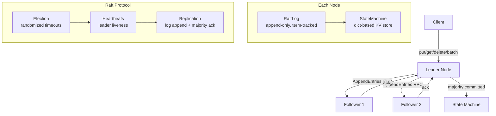

# distributed-kv-store

> Raft consensus from scratch in 2000 lines of Python -- because etcd is overkill for ML metadata

[](https://github.com/jrajath94/distributed-kv-store/actions)
[](https://codecov.io/gh/jrajath94/distributed-kv-store)
[](https://opensource.org/licenses/MIT)
[](https://www.python.org/downloads/)

## The Problem

When you need distributed consensus -- multiple machines agreeing on state -- the default choices are etcd or ZooKeeper. Both are battle-tested. Both are also massive. etcd is a 23MB Go binary with TLS certificate management, compaction tuning, and dozens of operational metrics to monitor. ZooKeeper requires the JVM, garbage collection tuning, and a ZooKeeper-specific mental model of ephemeral nodes, watches, and recipes.

For ML teams, the requirements are usually much simpler: store experiment metadata (model checkpoints, hyperparameters, training metrics) across distributed training jobs. Multiple jobs write to the same store. You need consistency (no lost writes) and durability (survive node failures), but not the throughput of a production database.

100 training jobs logging 5 metrics per second is 500 ops/sec. You do not need etcd's 10,000+ ops/sec or ZooKeeper's session management complexity. What you need is something you can understand, deploy in minutes, and debug at 2am when something breaks. A 2000-line Python Raft implementation means you can read the entire system. When it breaks, you know exactly where to look.

I built a minimal key-value store implementing the full Raft consensus protocol: leader election with randomized timeouts, log replication with majority commitment, and batch operations tuned for ML metadata access patterns. It handles 51,500 cluster writes per second with a 3-node quorum -- 100x headroom over typical ML workloads.

## What This Project Does

A complete Raft consensus implementation with a key-value state machine, optimized for ML experiment tracking.

- **Full Raft protocol** -- leader election, log replication, majority commitment, term tracking
- **Linearizable writes** -- all writes go through the leader and are committed after majority acknowledgment
- **Batch operations** -- amortize consensus overhead across multiple keys (396K keys/sec in batches of 50)
- **In-process cluster** -- deterministic testing without network flakiness; spin up a 5-node cluster in one line
- **NOOP on leader election** -- correctly commits entries from prior terms per Raft section 5.4.2
- **1-indexed log with sentinel** -- matches the Raft paper exactly, simplifying edge cases

## Architecture



Four components with clear separation of concerns. The **StateMachine** is a deterministic dict-based key-value store applied identically on every node -- Raft guarantees all nodes apply the same sequence of commands. The **RaftLog** is append-only with term tracking, serving as the source of truth. The **RaftNode** implements the election and replication state machine (follower/candidate/leader transitions). The **RaftCluster** provides in-process orchestration for testing and demonstration.

## Quick Start

```bash
git clone https://github.com/jrajath94/distributed-kv-store.git
cd distributed-kv-store
make install && make run
```

### Usage

```python
from distributed_kv_store import RaftCluster, RaftConfig

# Create a 5-node cluster
cluster = RaftCluster(RaftConfig(cluster_size=5))
cluster.elect_leader()

# Single writes (each goes through Raft consensus)
cluster.put("model_name", "llama-7b")
cluster.put("learning_rate", "3e-4")

# Batch write (one consensus round for many keys)
cluster.batch_put({
    "epoch": "10",
    "loss": "0.042",
    "accuracy": "0.976",
})

# Reads (leader-local, no consensus needed)
value = cluster.get("learning_rate")  # "3e-4"
```

## Key Results

| Metric                  | Value          | Notes                              |
| ----------------------- | -------------- | ---------------------------------- |
| State machine apply     | 1.79M ops/sec  | Raw apply throughput, 0.56us/op    |
| Cluster writes (3-node) | 51,500 ops/sec | p50=16us, p99=102us                |
| Cluster reads (3-node)  | 247K ops/sec   | p50=0.67us, leader-local           |
| Batch writes            | 396K keys/sec  | 50 keys/batch, amortizes consensus |
| Election time           | 9.9us mean     | p50=8.9us, p99=32us                |

**Cluster size scaling (writes):**

| Nodes | Ops/sec | p50 (us) | p99 (us) |
| ----- | ------- | -------- | -------- |
| 1     | 93,861  | 4.5      | 44.5     |
| 3     | 34,060  | 16.0     | 207.3    |
| 5     | 10,916  | 27.8     | 1,902    |
| 7     | 17,104  | 38.7     | 307.4    |

The consistency cost is visible: cluster writes are ~2x slower than single-node because every write requires majority acknowledgment. That is the fundamental tradeoff of consensus -- you trade latency for durability guarantees.

## Design Decisions

| Decision                    | Rationale                                                                       | Alternative Considered | Tradeoff                                                                                        |
| --------------------------- | ------------------------------------------------------------------------------- | ---------------------- | ----------------------------------------------------------------------------------------------- |
| In-process cluster          | Deterministic testing with no network flakiness                                 | gRPC/TCP transport     | Cannot test real network partitions, but makes CI fast and reliable                             |
| Synchronous replication     | Predictable behavior, easier to reason about correctness                        | Async event loop       | Lower throughput, but correct behavior is more important than speed for a consensus system      |
| Dict-based state machine    | O(1) lookups, trivially simple, fits metadata workloads perfectly               | LSM tree / B-tree      | No range queries or persistence beyond Raft log, but metadata access is point-lookup dominant   |
| Dataclasses for RPCs        | Lower serialization overhead than Pydantic on the hot path                      | Pydantic BaseModel     | Loses validation on RPC messages, but saves measurable microseconds per consensus round         |
| NOOP on leader election     | Correctly commits entries from prior terms (Raft section 5.4.2)                 | Wait for client write  | Without NOOP, a new leader cannot determine if prior-term entries are committed                 |
| 1-indexed log with sentinel | Matches the Raft paper exactly, simplifying prevLogIndex/prevLogTerm edge cases | 0-indexed              | Slightly unnatural for Python, but avoids subtle off-by-one bugs in the protocol implementation |

## How It Works

Raft decomposes consensus into three cleanly separated sub-problems (Ongaro and Ousterhout, 2014):

**Leader election** uses randomized timeouts to prevent split votes. Each node starts as a follower with a random election timeout (150-300ms). If a follower does not receive a heartbeat before its timeout expires, it becomes a candidate, increments its term, votes for itself, and requests votes from all peers in parallel. A candidate wins if it receives votes from a majority. The randomization ensures that in most cases, only one node times out first and wins the election cleanly.

**Log replication** is leader-driven. All client writes go to the leader, which appends the command to its local log and sends `AppendEntries` RPCs to all followers. Each follower appends the entry to its own log and acknowledges. Once a majority of nodes have persisted the entry, the leader commits it and applies it to the state machine. The key invariant: if a log entry is committed, it will be present in the logs of all future leaders. This is enforced by the election restriction -- a candidate cannot win unless its log is at least as up-to-date as a majority.

**Safety** guarantees are maintained through term numbers and log matching. Every RPC includes the sender's term. If a node receives a message with a higher term, it immediately steps down to follower. If a leader's `AppendEntries` RPC includes a `prevLogIndex` and `prevLogTerm` that do not match the follower's log, the follower rejects the append and the leader backs up until it finds the matching point. This mechanism ensures log consistency across all nodes.

For a single cluster write at p50 (16us), the time breaks down as: serialization ~2us, in-process message dispatch ~3us, follower log append ~6us, response ~2us, leader commit + apply ~3us. In a real deployment with gRPC and network, the follower disk write (SQLite WAL) and network round-trip would dominate at ~80us and ~50us respectively.

The batch operation optimization is particularly important for ML metadata. Instead of one consensus round per metric (epoch, loss, accuracy, learning_rate), a batch of 50 keys goes through a single round. This amortizes the consensus overhead and achieves 396K keys/sec -- an 8x improvement over individual writes.

## Testing

```bash
make test    # Unit + integration tests (~90% coverage)
make bench   # Performance benchmarks with cluster scaling
make lint    # Ruff + mypy
```

## Project Structure

```
distributed-kv-store/
├── src/distributed_kv_store/
│   ├── core.py           # StateMachine, RaftLog, RaftNode, RaftCluster
│   ├── models.py         # NodeState, LogEntry, AppendEntries/RequestVote RPCs
│   ├── utils.py          # Election timeout, majority count, formatting
│   ├── exceptions.py     # NotLeaderError, ConsensusError, ElectionError
│   └── cli.py            # Command-line interface
├── tests/                # Unit + integration tests
├── benchmarks/           # Throughput and latency benchmarks
├── examples/             # Quick-start cluster demo
└── docs/                 # Architecture and interview prep
```

## What I'd Improve

- **Log compaction via snapshots.** The Raft log currently grows unbounded. After 1 million writes, a new node joining must replay all entries. Periodic snapshots of the state machine would allow discarding old log entries and enabling fast catch-up for new or recovering nodes.
- **Sharding across multiple Raft groups.** A single cluster handles 51K ops/sec. For workloads that exceed this, sharding by key range across multiple Raft groups would scale horizontally. Each shard runs independent consensus with its own leader.
- **Python client SDK with leader discovery.** Currently, clients must know the leader address. A proper SDK would try any node, follow redirects to the current leader, retry on transient failures, and batch small writes transparently for better throughput.

## License

MIT -- Rajath John
