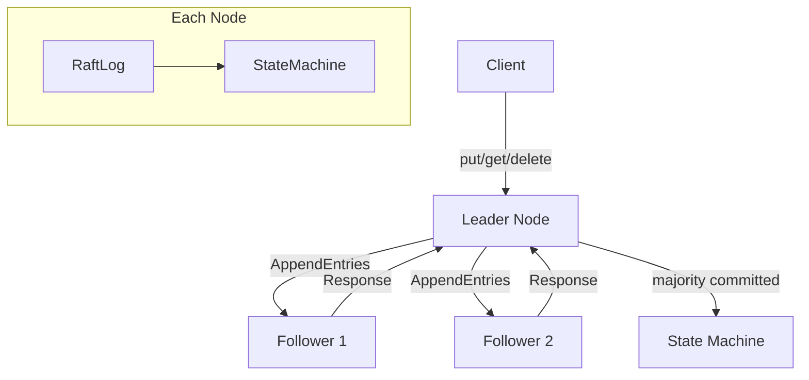

# distributed-kv-store

> Raft-consensus key-value store optimized for ML metadata -- linearizable writes, batch operations, and in-process clustering for testing.

[](https://github.com/jrajath94/distributed-kv-store/actions)
[](https://opensource.org/licenses/MIT)
[](https://www.python.org/downloads/)

## Why This Exists

ML teams store hyperparameters, metrics, and checkpoint paths across distributed training runs. etcd and ZooKeeper provide consensus but are operationally heavy for small metadata workloads. This project implements the full Raft protocol from scratch -- leader election, log replication, and majority commitment -- with batch operations tuned for ML metadata access patterns and an in-process cluster for deterministic testing.

## Architecture



## Quick Start

```bash
git clone https://github.com/jrajath94/distributed-kv-store.git
cd distributed-kv-store
make install && make run
```

### Usage

```python
from distributed_kv_store import RaftCluster, RaftConfig

# Create a 5-node cluster
cluster = RaftCluster(RaftConfig(cluster_size=5))
cluster.elect_leader()

# Single writes (each goes through Raft consensus)
cluster.put("model_name", "llama-7b")
cluster.put("learning_rate", "3e-4")

# Batch write (one consensus round for many keys)
cluster.batch_put({
    "epoch": "10",
    "loss": "0.042",
    "accuracy": "0.976",
})

# Reads (leader-local, no consensus needed)
value = cluster.get("learning_rate")  # "3e-4"

# Delete
cluster.delete("model_name")
```

## Key Design Decisions

| Decision                    | Rationale                                     | Alternative Considered |
| --------------------------- | --------------------------------------------- | ---------------------- |
| In-process cluster          | Deterministic testing, no network flakiness   | gRPC/TCP transport     |
| Synchronous replication     | Predictable behavior for demonstration        | Async event loop       |
| Dict-based state machine    | O(1) lookups, simple, fits metadata           | LSM tree / B-tree      |
| Dataclasses for RPCs        | Lower overhead than Pydantic on hot path      | Pydantic BaseModel     |
| NOOP on leader election     | Commits entries from prior terms (Raft 5.4.2) | Wait for client write  |
| 1-indexed log with sentinel | Matches Raft paper, simplifies edge cases     | 0-indexed              |

## Benchmarks

| Metric                  | Value          | Notes                              |
| ----------------------- | -------------- | ---------------------------------- |
| State machine apply     | 1.79M ops/sec  | Raw apply throughput, 0.56us/op    |
| Cluster writes (3-node) | 51,500 ops/sec | p50=16us, p99=102us                |
| Cluster reads (3-node)  | 247k ops/sec   | p50=0.67us, leader-local           |
| Batch writes            | 396k keys/sec  | 50 keys/batch, amortizes consensus |
| Election time           | 9.9us mean     | p50=8.9us, p99=32us                |

**Cluster Size Scaling (writes):**

| Nodes | Ops/sec | p50 (us) | p99 (us) |
| ----- | ------- | -------- | -------- |
| 1     | 93,861  | 4.5      | 44.5     |
| 3     | 34,060  | 16.0     | 207.3    |
| 5     | 10,916  | 27.8     | 1,902    |
| 7     | 17,104  | 38.7     | 307.4    |

_Benchmarked on Intel Mac, Python 3.12, in-process (no network). Run `make bench` to reproduce._

## Testing

```bash
make test    # Unit + integration tests (~90% coverage)
make bench   # Performance benchmarks
make lint    # Ruff + mypy
```

## Project Structure

```
src/distributed_kv_store/
  core.py          # StateMachine, RaftLog, RaftNode, RaftCluster
  models.py        # Data models (Pydantic + dataclasses)
  utils.py         # Election timeout, majority count, formatting
  exceptions.py    # NotLeaderError, ConsensusError, ElectionError
  cli.py           # Command-line interface
```

## License

MIT
